# dialogflow-fulfillment-app-v2
Utilizado em Workshops de# DialogFlow Fulfillment

Este é o projeto base para o Hands-On desenvolvido pela [CrudTec](https://crudtec.com.br) para fins de estudo.

Contribuições no projeto são bem-vindas.

## O que é o "Fulfillment" ?

O termo se refere à funcionalidade de consumir informação de forma dinâmica durante o fluxo do chatbot, por exemplo mostrar a cotação do dólar.

No exemplo do dólar, sabemos que essa informação muda a todo momento e por isso precisamos consumir ela de uma API externa que devolva essa informação atualizada automaticamente, essa é uma regra de negócio dinâmica na aplicação. Usando o Fulfillment conseguimos atender ela sem problemas.

No DialogFlow podemos utilizar o Fulfillment "Inline" ou "Webhook".

- **Inline**

    Nesse tipo podemos programar no próprio site do DialogFlow. Muito útil para pequenos fluxos ou fluxos simples.

    Utiliza a suíte de produtos Firebase by Google e por isso temos total liberdade dentro dos produtos Google, inclusive Google Cloud Plataform.

    Possui algumas desvantagens:
    
    - Só pode ser programado utilizando a linguagem JavaScript (NODE.JS);
    - Só existe um arquivo que pode ser programado (Não é possível criar várias classes/arquivos);
    - É difícil de debugar o código;
    - Na versão gratuita apenas os produtos do Google estão acessíveis.

- **Webhook**

    No WEBHOOK colocamos o link da nossa API ao invés do código pronto na página do DialogFlow.

    A API precisa atender aos padrões do DialogFlow de autenticação, payload, segurançam, etc.

    Pode ser programada em qualquer linguagem capaz de responder à requisições HTTP.

    Aqui pode-se utilizar quantas classes quiser, por mais que o DialogFlow acesse apenas uma API independente da intenção, do lado da API, é possível tomar a decisão de pra onde essa requisição deve ser enviada, uma vez que ela recebe o nome da itenção.

    Possui algumas desvantagens:

    - Mais difícil de implementar;
    - Precisa ter autenticação na API ao menos em nível básico;


O Fulfillment pode receber, e na maioria das vezes deve receber, parâmetros digitados pelo usuário na conversa. Geralmente esses parâmetros são as intenções, entidades de sistema, desenvolvedor ou sessão.

## Mão na massa

Agora que já sabemos tudo sobre Fulfillment vamos colocar a mão na massa:

**Vamos criar um Fulfillment capaz de criar eventos no Google Calendar para uma Clínica Médica**

A regra de negócio será bem simples. O paciente pode agendar consulta com qualquer especialista cadastrado nas entidades do DialogFlow. Os parâmetros obrigatórios para nosso Fulfillment são:

- Dia da consulta
- Horário da consulta
- Especialidade da consulta

Nossa clínica será 24 horas. Podem haver vários agendamentos para um mesmo horário desde que sejam agendamentos para especialidades diferentes. Caso o horário desejado já possua agendamento deve-se então tentar achar outro horário para o paciente e responder com as alternativas. Caso esteja disponível pode-se agendar imediatamente.

**Vamos utilizar o Fulfillment Inline com um código simples para facilitar o entendimento**

1) Ative o Fulfillment no DialogFlow:


2) Na sessão package.json coloque as dependências. Basta copiar o código abaixo da imagem e substituir:


```json
{
  "name": "DialogflowFirebaseWebhook",
  "description": "Firebase Webhook dependencies for a Dialogflow agent.",
  "version": "0.0.1",
  "private": true,
  "license": "Apache Version 2.0",
  "author": "Google Inc.",
  "engines": {
    "node": "6"
  },
  "scripts": {
    "lint": "semistandard --fix \"**/*.js\"",
    "start": "firebase deploy --only functions",
    "deploy": "firebase deploy --only functions"
  },
  "dependencies": {
    "firebase-functions": "^2.0.2",
    "firebase-admin": "^5.13.1",
    "googleapis": "^27.0.0",
    "actions-on-google": "2.2.0",
    "dialogflow-fulfillment": "0.5.0"
  }
}
```

3) Ao lado da sessão package.json cliquem em index.js e cole o seguinte código:

```javascript
/**
 * Código feito pela CRUDTEC adaptado do site do DialogFlow.com
 * Acesse nosso site em www.crudtec.com.br
 * Responsáveis: Rafael Sotero @soterocra e Wladimir Teixeira @wladimirteixeira
 * Objetivo: Inserir eventos de uma clínica no Google Calendar utilizando o Fulfillment Inline do DialogFlow.
 */

'use strict';

const functions = require('firebase-functions');
const {
    google
} = require('googleapis');
const {
    WebhookClient
} = require('dialogflow-fulfillment');

// ## Insira o código do seu calendário criado.
const calendarId = ''; // Exemplo: 6ujc6j6rgfk02cp02vg6h38cs0@group.calendar.google.com

// ## Insira a sua chave de integração com o Google Calendar
const serviceAccount = {}; // Esse objeto JSON parece com: { "type": "service_account", ... }

const serviceAccountAuth = new google.auth.JWT({
    email: serviceAccount.client_email,
    key: serviceAccount.private_key,
    scopes: 'https://www.googleapis.com/auth/calendar'
});

const calendar = google.calendar('v3');
process.env.DEBUG = 'dialogflow:*'; // Ativa as libs de degug.

const timeZone = 'America/Sao_Paulo'; // Coloque aqui seu timezone, referencia: https://en.wikipedia.org/wiki/List_of_tz_database_time_zones
const timeZoneOffset = '-03:00'; // Coloque aqui a diferença de horas com UTC da sua região, referência: https://en.wikipedia.org/wiki/List_of_tz_database_time_zones

let specialistBusy = false;
let possibleRanges = {
    1: true,
    2: true,
    3: true
}
exports.dialogflowFirebaseFulfillment = functions.https.onRequest((request, response) => {
    const agent = new WebhookClient({
        request,
        response
    });

    function makeAppointment(agent) {                
        const appointmentDuration = 1; // Define que uma consulta possui 1 hora.
        const dateTimeStart = convertParametersDate(agent.parameters.date, agent.parameters.time);
        const dateTimeEnd = addHours(dateTimeStart, appointmentDuration);
        const appointmentTimeString = getLocaleTimeString(dateTimeStart);
        const appointmentDateString = getLocaleDateString(dateTimeStart);
        // Verifica a disponibilidade no calendário. Recebe como parâmetro a data que o usuário escolheu e a especialidade. Entidades do DialogFlow.
        return createCalendarEvent(dateTimeStart, dateTimeEnd, agent.parameters.especialidade).then(() => {
            agent.add(`Ok. Consulta marcada para ${appointmentDateString} as ${appointmentTimeString}. Veremos voce em breve, ate logo.`);
        }).catch(() => {            
            let possibles = "";

            if (possibleRanges['1'] === true) {
                possibles += getLocaleTimeString(addHours(dateTimeStart, 1)) + ', ';
            }

            if (possibleRanges['2'] === true) {
                possibles += getLocaleTimeString(addHours(dateTimeStart, 2)) + ', ';
            }

            if (possibleRanges['3'] === true) {
                possibles += getLocaleTimeString(addHours(dateTimeStart, 3)) + ', ';
            }
        
            if (possibles != '') {
                agent.add(`Olha, não temos disponibilidade para esse horário. Veja esse(s) outro(s) horário(s): ${possibles}e caso decida me chame novamente.`)
            } else {
                agent.add(`Infelizmente esse horário não está disponível, pode tentar novamente em outra data?`);
            }
        });
    }
    let intentMap = new Map();
    intentMap.set('SUA INTENCAO AQUI', makeAppointment); // Essa parte mapeia a intenção 'SUA INTENCAO AQUI' para a funcao 'makeAppointment()'. Substitua 'SUA INTENCAO AQUI' pela sua intenção do DialogFlow.
    agent.handleRequest(intentMap);
});

function createCalendarEvent(dateTimeStart, dateTimeEnd, especialidade) {
    return new Promise((resolve, reject) => {
        calendar.events.list({ // Lista todos os eventos em um período específico.
            auth: serviceAccountAuth,
            calendarId: calendarId,
            timeMin: dateTimeStart.toISOString(),
            timeMax: dateTimeEnd.toISOString()
        }, (err, calendarResponse) => {
            
            if (err) {
                console.log(err);
                reject(err);
            }
            
            // Se houver algo no período, verificar se é no horário que o usuário escolheu e se for verifica se a especialidade está ocupada.
            if (calendarResponse.data.items.length > 0) {            
                for (var i = 0; i < calendarResponse.data.items.length; i++) {
                    var item = calendarResponse.data.items[i];
                    var itemStartDateTime = new Date(item.start.dateTime);
                    var itemEndDateTime = new Date(item.end.dateTime);

                    var userStartDateTime = new Date(dateTimeStart);
                    var userEndDateTime = new Date(dateTimeEnd);

                    if (
                        (itemStartDateTime >= userStartDateTime && itemStartDateTime <= userEndDateTime) ||
                        (itemEndDateTime >= userStartDateTime && itemEndDateTime <= userEndDateTime)) {
                        if (item.summary.toLowerCase().indexOf(especialidade.toLowerCase()) >= 0) {
                            specialistBusy = true;
                        }
                    }
                }
            }

            
            // Se a especialidade estiver ocupada, então tenta procurar outros horários para sugerir ao usuário.
            if (specialistBusy) {
                for (var i = 1; i <= 3; i++) {
                    for (var j = 0; j < calendarResponse.data.items.length; j++) {
                        var item = calendarResponse.data.items[j];
                        var itemStartDateTime = new Date(item.start.dateTime);
                        var itemEndDateTime = new Date(item.end.dateTime);

                        var userStartDateTime = new Date(addHours(dateTimeStart, i));
                        var userEndDateTime = new Date(addHours(dateTimeEnd, i));

                        if (
                            (itemStartDateTime >= userStartDateTime && itemStartDateTime <= userEndDateTime) ||
                            (itemEndDateTime >= userStartDateTime && itemEndDateTime <= userEndDateTime)) {
                            if (item.summary.toLowerCase().indexOf(especialidade.toLowerCase()) >= 0) {
                                possibleRanges[i] = false;
                            }
                        }
                    }
                }
                reject(new Error('Especialidade oculpada.'));
            }

            
            // Se a especialidade não estiver ocupada realiza o agendamento imediatamente.
            if (!specialistBusy) {                
                calendar.events.insert({
                    auth: serviceAccountAuth,
                    calendarId: calendarId,
                    resource: {
                        summary: especialidade,
                        start: {
                            dateTime: dateTimeStart
                        },
                        end: {
                            dateTime: dateTimeEnd
                        }
                    }
                }, (err, event) => {
                    err ? reject(err) : resolve(event);
                });
            }
        });
    });
}

// Uma função helper para resolver 'date' e 'time' Dialogflow's e retornar uma parâmetro de datetime.
function convertParametersDate(date, time) {
    return new Date(Date.parse(date.split('T')[0] + 'T' + time.split('T')[1].split('-')[0] + timeZoneOffset));
}

// Uma função helper que adiciona um valor inteiro 'hoursToAdd' para a instancia de data 'dateObj' e retorna uma nova instancia de data.
function addHours(dateObj, hoursToAdd) {
    return new Date(new Date(dateObj).setHours(dateObj.getHours() + hoursToAdd));
}

// Uma funçào helper que converte uma instancia de data 'dateObj' em uma string que representa essa hora em portugues brasil.
function getLocaleTimeString(dateObj) {
    return dateObj.toLocaleTimeString('pt-BR', {
        hour: 'numeric',
        hour12: false,
        timeZone: timeZone
    });
}

// Uma funçào helper que converte uma instancia de data 'dateObj' em uma string que representa essa data em portugues brasil.
function getLocaleDateString(dateObj) {
    return dateObj.toLocaleDateString('pt-BR', {
        weekday: 'long',
        month: 'long',
        day: 'numeric',
        timeZone: timeZone
    });
}
```


4) Clique no botão de "Deploy" do Editor. Essa ação de deploy pode levar mais de 1 minuto.

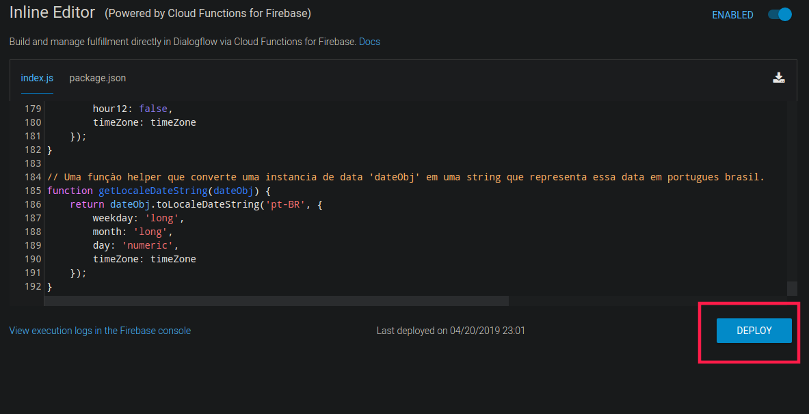

----

**Agora que o código está salvo precisamos preencher algumas variáveis que estão nele:** 

```javascript
// ....

// ## Insira o código do seu calendário criado.
const calendarId = ''; // Exemplo: 6ujc6j6rgfk02cp02vg6h38cs0@group.calendar.google.com

// ## Insira a sua chave de integração com o Google Calendar
const serviceAccount = {}; // Esse objeto JSON parece com: { "type": "service_account", ... }


// ....
```

A primeira variável vamos conseguir criando um calendário no Google Calendário.

A segunda vamos conseguir criando um novo serviço de API no Google Cloud.

----

Continuemos:

5) Abra o [Google Calendar](http://google.com) e na barra lateral procure a opção e clique em "Criar nova agenda":

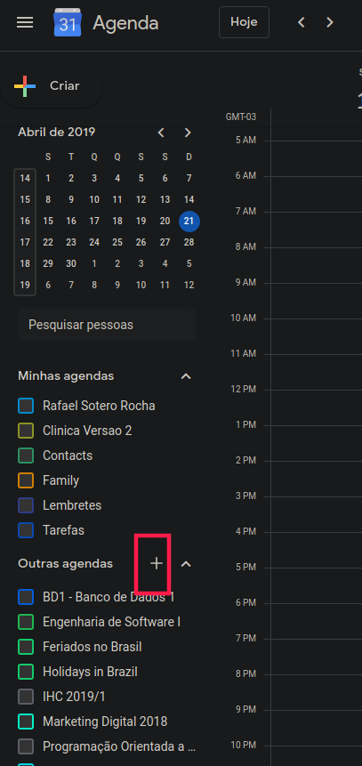

6) Dê um nome para sua Agenda, por exemplo: "Clínica Médica" e clique em "Criar Agenda".

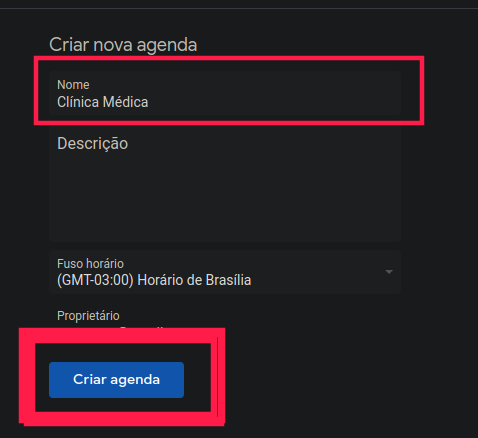

7) Com a agenda criada volte para a página inicial do Google Calendar, deixe apenas a agenda criada selecionada. Clique sobre os três pontos e vá até a opçào de configurações.

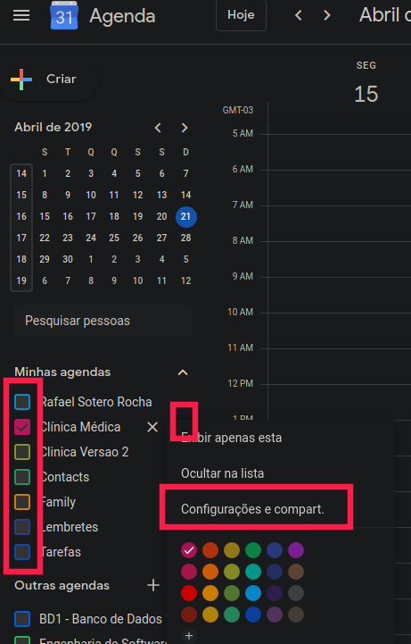

8) Já na parte de configurações na sessão "Integrar Agenda" você encontra o ID da Agenda, é ele que será utilizado para preencher a variável "calendarId".


**Em uma nova aba volte para a página do Fulfillment no Dialogflow e coloque essa informação no código:**

```javascript
// ....

// ## Insira o código do seu calendário criado.
const calendarId = 'SEU_ID_GOOGLE_CALENDAR@group.calendar.google.com'; // Exemplo: 6ujc6j6rgfk02cp02vg6h38cs0@group.calendar.google.com

// ....
```

**NÃO ESQUEÇA DE APERTAR O BOTÃO DE DEPLOY PARA SALVAR SEU CÓDIGO**


9) Ainda não feche a página de configurações do GOOGLE CALENDAR, em uma NOVA ABA, abra o DialogFlow e navegue até a opção de configuração e em seguida clique no ID do Google Cloud.

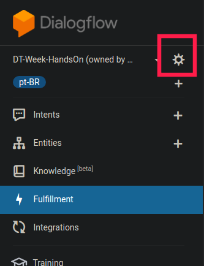

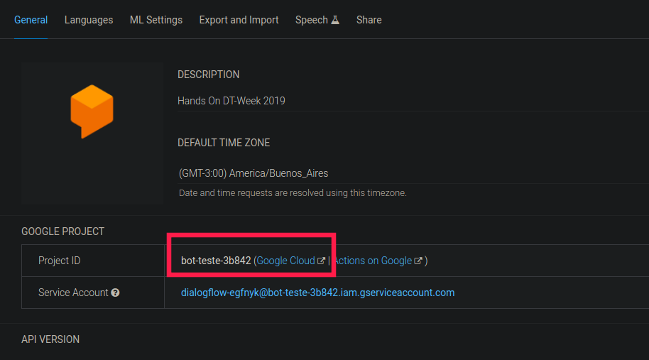

10) Com a página do Google Cloud Aberta siga as orientações para ativar a API do Google Calendar e criar uma nova chave de autenticação na sua agenda.

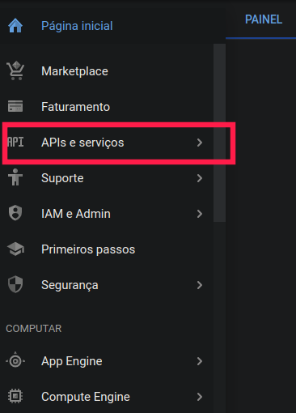
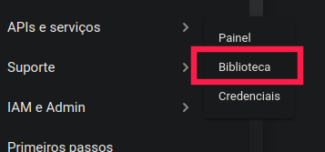
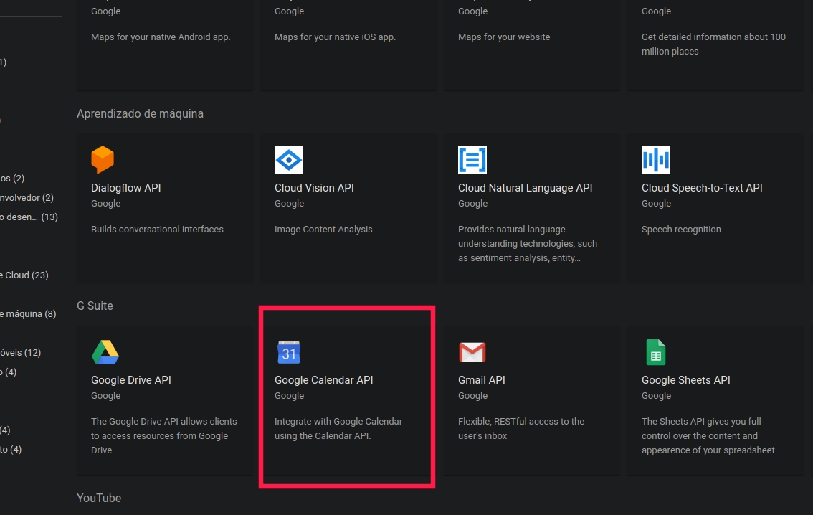
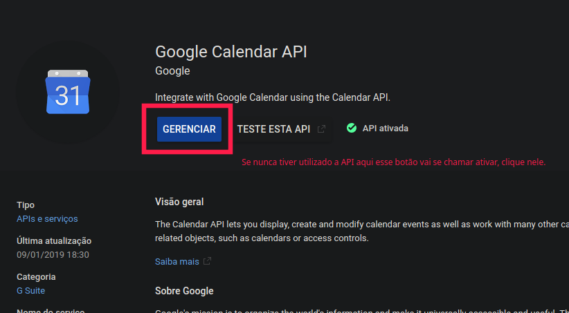
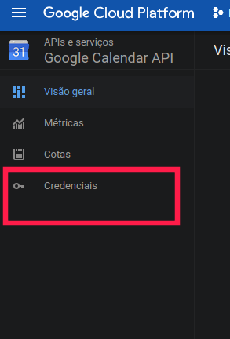

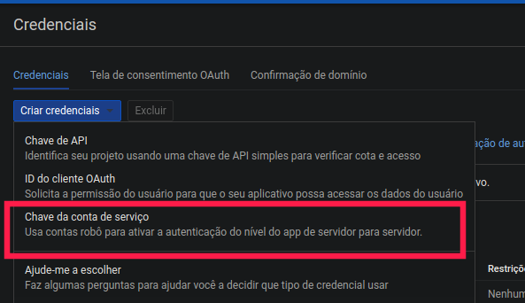
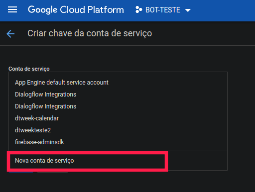
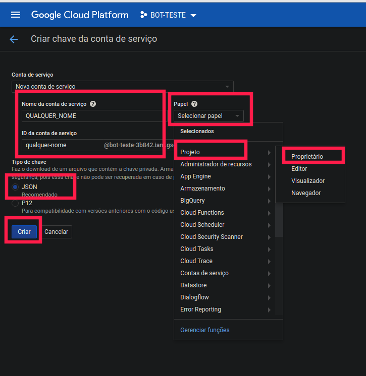
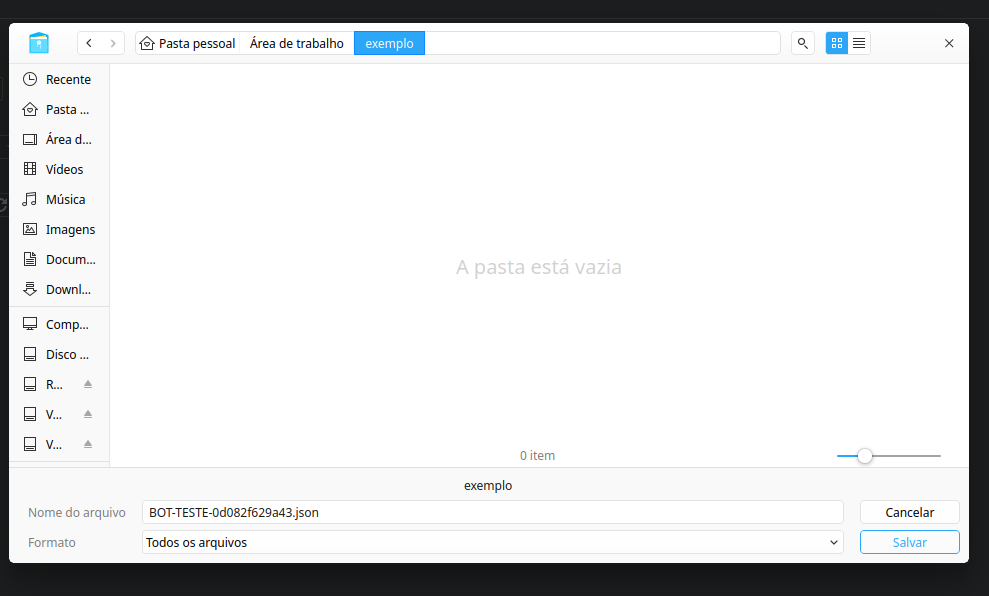


Após seguir cuidadosamente os passos acima temos a chave da nossa api para substituir na segunda variavel, abra o arquivo de texto baixado no ultimo passo, copie todo seu conteúdo e coloque na segunda variável.

```javascript
// ....

// ## Insira a sua chave de integração com o Google Calendar
const serviceAccount = { "type": "service_account", ... }; // Esse objeto JSON parece com: { "type": "service_account", ... }


// ....
```

Na tela do Fulfillment no DialogFlow clique em Deploy depois de fazer as alterações.

10) Dentro do arquivo de texto existe a conta de e-mail sistêmica que criamos que precisa ter acesso de alteração em nosso calendário.

```json
"client_email": "qualquer-nome@bot-teste-3b842.iam.gserviceaccount.com",
```

Copie o seu client_email e volte para a tela de configuração do google calendar.

Nessa tela, na opção "Compartilhar com pessoas específicas" adicione o endereço de e-mail do client_email conforme a imagem abaixo, atenção para as PERMISSÕES:

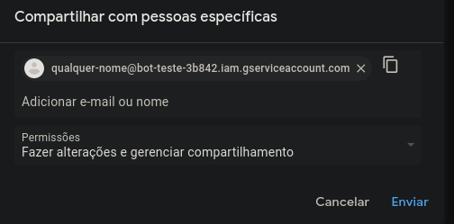

E clique em enviar.


11) Por último, mas não menos importante, verifique se a seguinte linha corresponde ao nome da sua itenção que manda data, hora e especialista para seu Fulfillment:

```javascript
intentMap.set('SUA INTENCAO AQUI', makeAppointment); // Essa parte mapeia a intenção 'SUA INTENCAO AQUI' para a funcao 'makeAppointment()'. Substitua 'SUA INTENCAO AQUI' pela sua intenção do DialogFlow.

```

Caso não, substitua o nome entre aspas simples.

Também verifique se sua intenção está chamando fulfillment quando executada na tela de intenção no DialogFlow:


## Finalizando

É com prazer que informo que concluímos nosso hands on. Vamos testar? BOTs Inteligentes

## Dúvidas, sugestões ou contribuições

[Rafael Sotero](https://github.com/soterocra) e [Wladimir Neto](https://github.com/wladneto)

ou  falecom@crudtec.com.br
